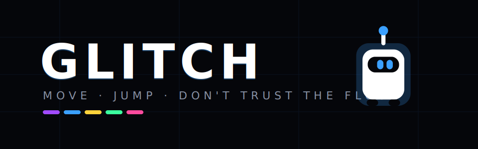
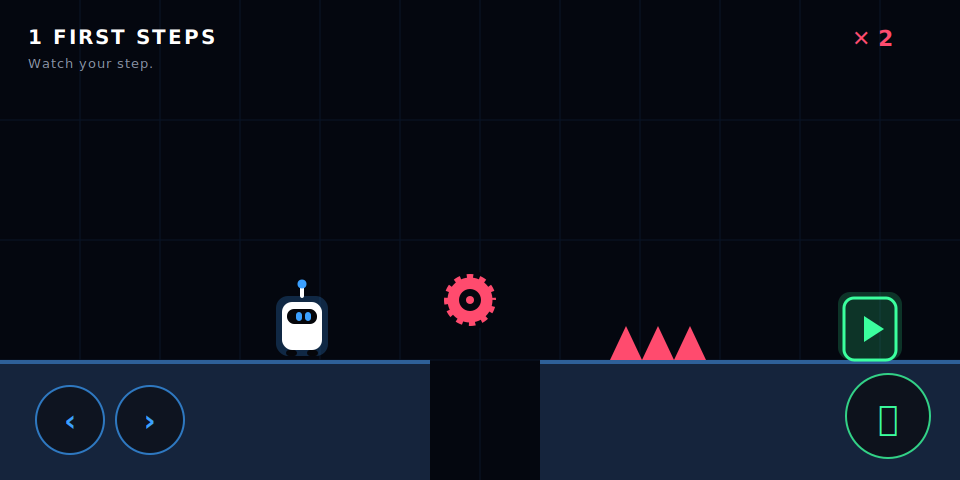
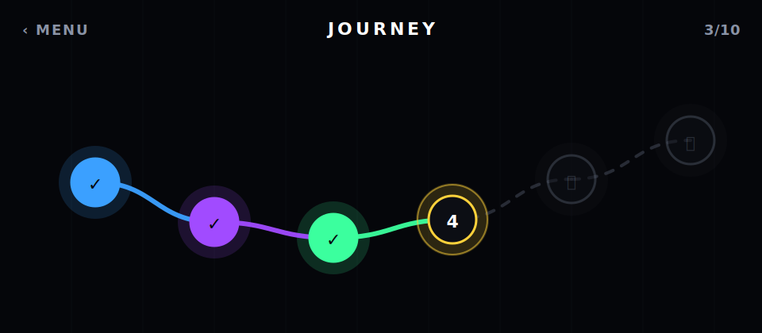

# GLITCH

A fast, minimal **dark-neon platformer** for iOS & Android where **nothing is safe**. Tap-tight controls, hand-crafted traps, and a level that lies to you — in the spirit of *Level Devil*. Built with Expo (SDK 56), React Native Skia, Matter.js, Reanimated and Gesture Handler.

> Move, jump, and learn the hard way: the floor vanishes, spikes pop up, ceilings drop, and the only way forward is to die a few times and remember.



---

## ✨ Features

- **20 hand-crafted levels**, each with a *unique* signature mechanic, its own neon theme, and rising difficulty — no repeated patterns.
- **A living level map** — a glowing, animated journey path (not a flat list) that lights up as you progress.
- **Responsive manual controls** — on-screen Left / Right / Jump with true multi-touch (move *and* jump together), variable-height jumps, coyote time and jump buffering for a tight feel.
- **Surprise-driven trap design** — fake platforms, crumbling stones, pop-up spikes, falling blocks, saws, crushers, conveyors, bounce pads, phasing platforms, laser gates — plus second-wave mechanics: **wind zones, ice, portals, pendulums, an advancing kill-wall, dash gates and gravity flips**.
- **Haptic feedback throughout** — jumps, landings, bounces, dashes, teleports, gravity flips, deaths, wins and every UI press (toggleable on the menu).
- **A polished procedural character** — a neon robot animated entirely in code (squash & stretch, run cycle, glow, death burst). No sprite assets.
- **60 fps engine** — fixed-timestep physics with render interpolation; the whole render path runs on the UI thread with **zero React re-renders**.
- **Landscape**, **instant respawn**, per-level best/deaths, and a fully **data-driven** level system.

## 🎮 Controls

| Action | Control |
| --- | --- |
| Move left / right | **‹** / **›** buttons (bottom-left) |
| Jump | **⤴** button (bottom-right) — tap = short hop, **hold = higher jump** |
| Move + jump together | Multi-touch (hold a direction, tap jump) |
| Retry | Instant on death; or **RETRY** on the clear screen |

## 🗺️ The journey



| # | Name | Theme | Signature mechanic |
| --- | --- | --- | --- |
| 1 | First Steps | Circuit | Precision jumps + pop-up spike |
| 2 | Liars | Void | Fake platforms + hidden spikes |
| 3 | Don't Stop | Toxic | Crumbling stones over spikes |
| 4 | Riders | Foundry | Moving-platform ferries |
| 5 | Belt | Neon | Conveyor floors (push you back / launch you) |
| 6 | Spring | Frost | Bounce-pad climbing |
| 7 | Sawmill | Ember | Spinning saw gauntlet |
| 8 | Ceiling | Pulse | Falling blocks + crushers (danger from above) |
| 9 | Rhythm | Abyss | Phasing platforms + laser gates |
| 10 | Gauntlet | Overload | Everything (act-1 finale) |
| 11 | Headwind | Gale | Wind zones (head/tail gusts) |
| 12 | Slip | Glacier | Ice floors (no traction) |
| 13 | Warp | Rift | Portal teleporters |
| 14 | Pendulums | Swing | Swinging blades |
| 15 | The Wall | Outrun | An advancing wall of spikes |
| 16 | Dash | Velocity | Dash gates over spike pits |
| 17 | Invert | Upside Down | Gravity-flip ceiling run |
| 18 | Chaos | Storm | Ice **+** wind combo |
| 19 | Pressure | Relay | Chaser **+** portal **+** pendulum |
| 20 | Singularity | Singularity | Every mechanic (grand finale) |

## 🧱 Tech stack

- **Expo SDK 56** (React Native 0.85, React 19) — no Expo Router; custom **React Navigation** stack
- **@shopify/react-native-skia** — all in-game rendering
- **react-native-reanimated** — the engine→render bridge (shared values) + UI animations
- **react-native-gesture-handler** — multi-touch controls
- **matter-js** — physics/collision
- **zustand** — UI/progression state
- **expo-screen-orientation** — landscape lock

## 🚀 Getting started

> **Node ≥ 20.19.4 is required** (Expo SDK 56). An `.nvmrc` is included.

```bash
nvm use            # selects 20.19.4 from .nvmrc
npm install
npm run ios        # or: npm run android
```

If you start Metro another way, run `npx expo start -c` once (the `-c` clears the cache so `metro.config.js` is picked up). Orientation is locked to landscape at runtime; on a custom dev build you may also need `npx expo prebuild` for the native manifest change.

Type-check / bundle checks:

```bash
npm run typecheck
npx expo export --platform ios   # or android — validates the full bundle
```

## 📂 Project structure

```
src/
  engine/         # isolated game engine (no React)
    GameLoop.ts        fixed-timestep loop + interpolation
    GameEngine.ts      per-level orchestrator + render bridge
    LevelRuntime.ts    the actual simulation (player + entities)
    entities/          mechanic classes (platforms, hazards) + factory
  physics/        # Matter.js wrapper
  collision/      # grounded detection
  camera/         # follow + clamp + shake
  entities/player # manual-movement player
  input/          # polled InputState (controls -> engine)
  levels/         # DATA: types, themes, registry, defs/level01..10
  components/
    game/         # Skia renderer, character, controls, HUD, overlays
    levelmap/     # animated level-map node
    ui/           # NeonButton
  screens/        # MainMenu, LevelSelect (map), Game
  navigation/     # custom React Navigation stack
  store/          # zustand (game + progression)
  constants/      # tuning, theme, controls
```

## ➕ Adding a level (no core changes)

The level system is **data-driven and scalable** — a level is a plain object.

1. Copy `src/levels/defs/level10.ts` to `levelXX.ts`, give it a new `id`, `name`, `theme` (via `makeTheme`), `spawn`, `goal`, `size`, and an `entities` array.
2. Add it to the `LEVELS` array in `src/levels/registry.ts` (one import + one line).

That's it. The level-select map, unlock flow, "next level" and the engine all read from `LEVELS`, so the new level appears everywhere automatically. See **[docs/GAMEPLAY.md](docs/GAMEPLAY.md)** for the full schema and a worked example.

## 📖 How it all works

**[docs/GAMEPLAY.md](docs/GAMEPLAY.md)** explains — in plain language with detail — how the character moves and jumps, how every trap/element moves, how collisions and death work, how the camera follows, how rendering stays at 60 fps, the level data format, and how to add new levels and mechanics.

## 🗺️ Roadmap

- Persist progress (AsyncStorage / cloud save)
- Audio + haptics, particles
- More worlds, a level editor/export, daily challenges, leaderboards

> Note: the in-repo images are illustrative renders that match the game's exact shapes and palette. To capture real device frames, run on a simulator and use the platform screenshot tool.

---

🤖 Built with [Claude Code](https://claude.com/claude-code)
